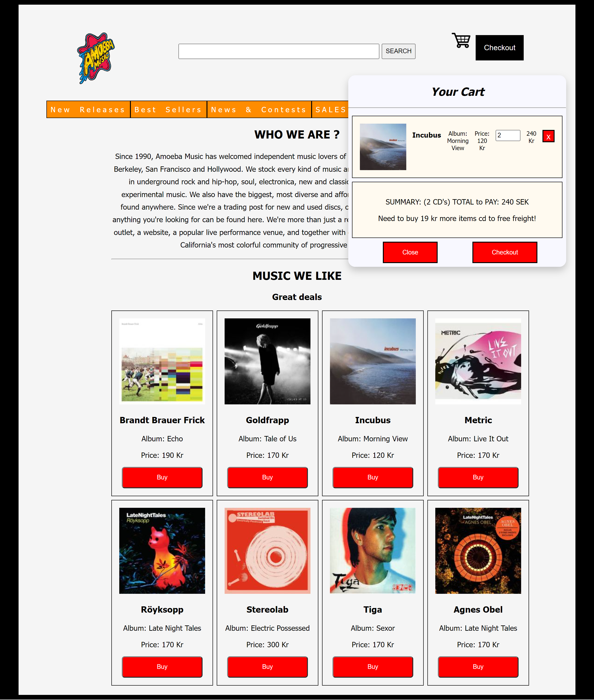

### October 2021

**Project Summary**

A simple music CD shop web app with a dynamic shopping cart. Users can browse albums, add them to the cart, adjust quantities, and see subtotals, total price, and a “free shipping” indicator once they reach the 259 kr threshold.

---

## General View



---

### 🛠️ Technologies Used

- **HTML5** for semantic page structure
- **CSS3** (Flexbox & Grid) for layout and styling
- **Vanilla JavaScript** for all cart-logic, event handling, and DOM updates

---

### 🚀 How to Run the Project Locally

1. **Clone or download** the project folder

   ```bash
   git clone <your-repo-url>
   cd <project-folder>
   ```

2. **Open in browser**

   - Simply double-click `index.html`
   - **OR** serve via a lightweight HTTP server (recommended for proper module/asset loading):

     ```bash
     # If you have Python installed
     cd <project-folder>
     python3 -m http.server 8000
     # Then visit http://localhost:8000 in your browser
     ```

3. **Enjoy**

   - Browse the CD catalog
   - Click the cart icon or “Buy” buttons to add items
   - Change quantities in the cart and watch totals update in real time

---

### 📄 [Detailed Information of the Project](Detail_Info.md)
