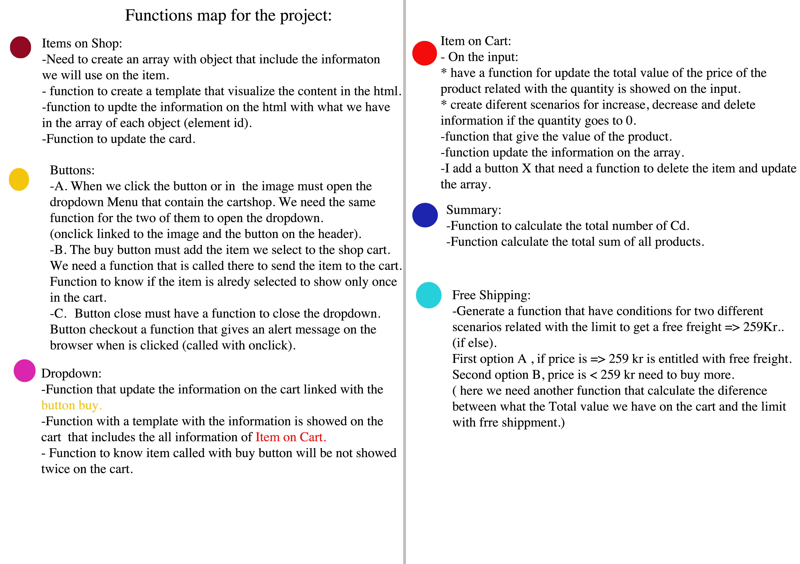
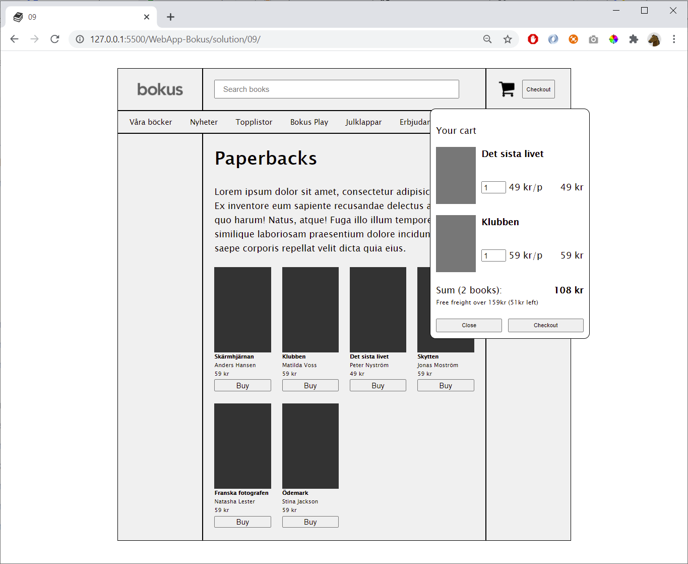

### October 2021

**Project Summary**

A simple music CD shop web app with a dynamic shopping cart. Users can browse albums, add them to the cart, adjust quantities, and see subtotals, total price, and a “free shipping” indicator once they reach the 259 kr threshold.

---

### 🛠️ Technologies Used

* **HTML5** for semantic page structure
* **CSS3** (Flexbox & Grid) for layout and styling
* **Vanilla JavaScript** for all cart-logic, event handling, and DOM updates

---

### 🚀 How to Run the Project Locally

1. **Clone or download** the project folder

   ```bash
   git clone <your-repo-url>
   cd <project-folder>
   ```
2. **Open in browser**

   * Simply double-click `index.html`
   * **OR** serve via a lightweight HTTP server (recommended for proper module/asset loading):

     ```bash
     # If you have Python installed
     cd <project-folder>
     python3 -m http.server 8000
     # Then visit http://localhost:8000 in your browser
     ```
3. **Enjoy**

   * Browse the CD catalog
   * Click the cart icon or “Buy” buttons to add items
   * Change quantities in the cart and watch totals update in real time

---


### Oktober 2021

## Project realized by Ursula Vallejo Janne for the Course Programmering 1.
### HTML/CSS/JS

# General view:


###  Detailed information on the process of the project below:

#CONTENT:

- [1. General Projektplan](#1-general-projektplan-)
- [2. Dokumentation](#2-dokumentation--)
    - [Steg 1: HTML](#steg-1-html)
    - [Steg 2: CSS](#steg-2-css)
    - [Steg 3: JS](#steg-3-js)
    - [Steg 4: konklusionen](#steg-4-konklusionen)
    - [Steg 5: övriga](#steg-5-vriga)
  
- [3.Uppgifter Info](#3-uppgifter-info)

# 1. General Projektplan :

I informationen om projektet i trello jag utarbetade det baserat på den analys som jag gjorde av projektet på musikwebbplatsen och lägga till de delar av kraven krävs i detta. 

De punkter som delar upp projektet kan ses mer detaljerat i dokumentationsavsnittet.

I mitt projekt kan du se en karta för varje Steg i projektet, en beskrivning av kraven i varje och de detaljer som arbetades med.
Också ett kort för varje som krävs för att få kvalifikationer.

Du kan se mitt projektplan i länken nedan:

[Trello Webbsida ](https://trello.com/invite/b/Z3Nuvnwx/986973450a0dfb68d65c026a87d672d2/programmering-1)

I kursen har vi använt Trello-programmet för att kunna följa en organiserad arbetsplan, som styr projektmålen och kvalifikationskraven.

Detta program hjälper dig att tydligt visualisera de avsnitt du arbetar med inom ett projekt.

På så sätt kan du hålla reda på vad som fungerar och vad som behöver göras. Således är man mer medveten om var projektet är och garanterar ett bättre resultat genom att inte utelämna saker på grund av glömska.

Jag tyckte personligen att det var mycket användbart att kunna styra och övervaka varje steg i projektet.

# 2. Dokumentation  :

Projektet består av att göra en musik-CD-butik där en kundvagn visas.  I kundvagnen kan du öka mängden av produkterna och ge oss en delsumma och ett totalt värde på kundvagnen.
I varukorgen får vi också information om det totala antalet CD nummer som har lagts till den och om inköpsvärdet gör att vi väljer gratis frakt eller hur mycket vi behöver för att komma åt detta.

Det första steget jag tog var att ta de 2 bilderna av projektet och gå in där vilka funktioner som ska höjas från vad som visualiseras i dokumentet på webben.

Vi ser detta nedan:





### Från diagrammet ovan hittade jag följande element som jag måste utveckla i projektet:

1. Checkout knapp som är flyttbar och öppnar listrutan.

2. Generera html för att lägga till innehållet.

3. två knappar behövs för öppnar varukorgen; den ena är en bild och den andra en knapp(se ut som om de är känsligt med mouse markören).

4. Inuti kundkorgen finns det två knappar i slutet av innehållet. man måste stänga rullgardinsmenyn och den andra visar ett varningsmeddelande när du checkar ut (se ut som om de är känsligt med mouse markören).

5. De artiklar som läggs till i kundvagnen måste ha bilden, artistnamnet, albumtiteln, en input för att variera kvantiteten på den produkten, den totala summan som är förhållandet mellan enheterna med priset och en knapp för att ta bort artikeln från varukorgen.

Valet som görs i input måste variera det belopp som ska betalas och när 0 produkter läggs tar det bort varan från kundvagnen.
 
6.i slutet av kundvagnen efter produkter, finns det en text som säger hur många cd-skivor som lades till i varukorgen och summan av alla produkter har valts.

7. En rad under Summary texten finns en textrad som säger om du med det belopp du väljer för fri frakt. Det finns två möjliga scenarier: 
    * A. Free freight over 259kr ( XX value kr left for free freight)
   * B. You have free freight.
   

### Från den första analysen utarbetade jag en karta över de steg som jag var tvungen att följa för utarbetandet av projektet som består av följande:

1.Skapa projektet i trello med de olika stegen att följa som jag identifierar i mitt projekt.

2.Skapa en allmän projektmapp som innehåller:
   * img mapp, README.md, index.html, style.css och script.js.

3.Generera html-innehåll för att kunna skriva den allmänna layouten för innehållet i musikarkivet med semantisk inledning.

4.Arbeta med CSS för att kunna ha butikens visuella layout.

5.Börja med javascript för att utveckla de funktioner som du bryter ut i analysdiagrammet för projektbilden som vi ser i början av den här dokumentationen. 

6. Kontrollera att sidan fungerar korrekt och att det inte finns några felmeddelanden på den.

7. Senaste Layoutinställningarna med CSS.

8. Den dokumentation som har genererats under utarbetandet av projektet kommer att vidarebefordras i README.

Nedan finns 3 avsnitt ett för html, ett annat för css och slutligen för JS där jag beskriver processen mer detaljerat i den process jag har haft i samband med utvecklingen av dessa i mitt projekt


## Steg 1: HTML

Detta är de steg som jag har följt när det gäller HTML för utvecklingen av detta projekt som jag också inkluderar om jag har haft några svårigheter och hur jag har löst det.

1. Söka efter 8 bilder, Store logo och information för  musikbutiksprodukter för att kunna koppla dem till projektet.
  ``````
   * lösning av problemet: 
   
   Bildens logotyp kom inte med en transparent bakgrund genom vilken den passerar i png-format och omvandlar den för att radera bakgrunden med Photoshop.


2.I webbhuvudet jag har skapat en Header med butikens logotyp ett sökfält och en knapp + en bild av kundvagnen.


3.Skapat en NavBar med optioner men inte functional.
    ```<navbar> / <ul>```

4.Skriva textinnehållet i huvudavsnittet.
    ```html <main> / <section> / <h1> <p>```

5.Skapat en Template för produktartiklar i html.
    ```html <main> / <section> / <article>```

## Steg 2: CSS

1.I projektet försökte jag använda istället för bilden av varukorgen en ikon för detta men jag fann att för detta i många var jag tvungen att installera ett bibliotek som inte kunde göras i projektet. Hitta intressant information som hur du använder ions icons och google fonts.

Äntligen bestämde jag mig för att använda bilden i png modifierad med en transparent bakgrund för att inte använda bibliotek eller externa länkar.

https://ionic.io/ionicons
```ion icons : usage (copy script) and add it to `<script src>`
the other link find installation (copy it) and add it to the head <link href:' '  rel:'stylesheet'>
before the style.css```

https://fonts.google.com/

2.För layouten ville jag att innehållet på sidan (head och main) skulle centreras och inkluderas i en ram för att markera och centrera innehållet.  I det här steget hade jag svårt att göra det så jag valde att skapa en extern ram där jag kunde fokusera allt. Idé är hämtad från boken HTML & CSS av Jon Duckett; Sida35 (arbetar med lådor).
http://www.htmlandcssbook.com/

3. För distribution av artikel-CD på webben väljer du en flexbox i drop menu och i huvudet ett grid.

4. Inom projektet försöka ändra storleken på pilarna för indata finns det i kundvagnen som jag inte kunde lösa eftersom svaret som hittades var mycket komplext för den information vi för närvarande har. Jag tycker att de är mycket små och det är dags att vara försiktig med att lägga till eller ta bort produkter i inmatningen.

```
The native input[type=number] controls are not style-able cross-browser. The easiest and safest way to achieve what you want cross-browser/cross-device is to hide them using:

input[type="number"] {
-webkit-appearance: textfield;
-moz-appearance: textfield;
appearance: textfield;
}
input[type=number]::-webkit-inner-spin-button,
input[type=number]::-webkit-outer-spin-button {
-webkit-appearance: none;
}
...which allows you to use your custom buttons, which could be linked to execute the functions the spinners (arrows) would (.stepUp() and .stepDown()), provided you keep the input's type="number".
```
https://stackoverflow.com/questions/45396280/customizing-increment-arrows-on-input-of-type-number-using-css

## Steg 3: JS

- Det första den genererar var dropdown menu för att kunna organisera innehållet i kundvagnen.

-Skapa ett diagram för att förstå funktionerna måste finnas på sidan som du kan se i början som functions map of teh project.


- ## funktioner som jag skapade:
1. Skapa array inklusive information om item som en objektet för att kunna inkludera alla aspekter som krävs för att det ska fungera i projektet.
Objektet i array var sammansatt så här:
```
{
artist: "Brandt Brauer Frick",
album: "Echo",
tag: "cd1",
price: 190,
img: "brandtBF.jpg",
},
```
2. Funktion öppna Dropdown.
3. Funktion stäng dropdown.
4. Funktion template products HTML. (dynamik).
5. Funktion mall produkt till varukorg checka ut (dynamik).
6. Funktion för att uppdatera element-ID på HTML.
7. Funktion för att uppdatera innehåll i kortet.
8. Funktion för att uppdatera information på rullgardinsmenyn : uppdaterar listrutan när matrisen ändras.
9. Funktion för att uppdatera innehåll html.
10.Funktion för att kontrollera antalet cd-skivor på varukorgen checka ut.
10. Funktion till kassan checkout: Visar utcheckningsmeddelande med avisering.
11. event listeners av button buy.
12. Funktion för att lägga till artikeln i varukorgen checka ut och uppdateras.
13. Funktion för att berätta vad som händer om varukorgen är tom / redan är där för att inte multiplicera.
14. Funktion för att kontrollera antalet objekt: om indata är 0 kommer objektet att tas bort från matrisen.
15. Funktion för att hitta total CD.
16. Funktion för att hitta det totala priset.
17. Funktion för fri frakt.
18. Funktion uppdatera kvantitet ett pris.
19. Funktion för att lägga till mer cd på indata.
20. Funktion för att ta bort objekt från array.


- ## Svårigheter och hur de löstes:

1. Min första svårighet var att fråga mig själv Hur lägger jag till föremålen på huvudsidan i kundvagnen.

Att skriva ut varukorgen i html jag hade tittat på denna renderingsfunktion men hur jag höjde den i klassen var tydligare för mig så jag valde att ändra den till den form den implementerades i klassen.


```
function render() {
const html = products.map(({ id, artist, album, genre, releaseDate, price, img }) =>
template(id, artist, album, genre, releaseDate, price, img)
);
listProducts.innerHTML = html.join("\n");
}
```


I ett första försök använde jag en frågeväljare på köpknappen men senare i klassen har vi sett hur man skapar den här funktionen på ett annat sätt, så jag bestämde mig för att sättet som togs upp i klassen var tydligare, så jag omprövade igen allt jag hade gjort med querry selector och bättre använda id.

2. En aspekt som är svår för mig att förstå är hur informationen kommer från array och att ha tillgång till den för att kunna använda den. Till exempel, när jag försökte komma åt priset för att beräkna det totala värdet, fick jag ett NAN. Jag började forska och stötte på begreppet rejex som tillämpas i olika sammanhang men jag var intresserad av att ge mig numeriskt värde. I första hand implementerade jag det i projektet, men när jag diskuterade det med min lärare föreslog han att jag inte längre skulle använda vissa funktioner, varför jag tog upp det igen och tittade noga på vilken typ av information jag hade med hjälp av typen av och tillämpa det vi såg i klassen.


Informationen jag hittade om hur du ändrar informationen ger mig en matris var följande:

https://www.codegrepper.com/code-examples/javascript/.match+rejex+js

convert elements of an array into a string:
(let energy= fruits.join())

https://www.w3schools.com/jsref/jsref_join.asp

3. En annan punkt där jag har haft ganska svårt var när jag försökte beräkna i vagnen kvantiteterna av produkterna och summorna. För att beräkna kvantiteterna hittade jag det i en foruminformation men bestämde mig för att inte använda den eftersom den läser data från HTML och inte i matrisen så jag anser inte att det är det mest optimala. Använd den inledningsvis men efter gjorde med information min lärare ge till mig och vad såg i projekten an ändra kompisar.


Källan där jag hittar den:

   https://stackoverflow.com/questions/13540751/how-get-total-sum-from-input-box-values-using-javascript

```
Qty1 : <input onblur="findTotal()" type="text" name="qty" id="qty1"/><br>
Qty2 : <input onblur="findTotal()" type="text" name="qty" id="qty2"/><br>
Qty3 : <input onblur="findTotal()" type="text" name="qty" id="qty3"/><br>
Qty4 : <input onblur="findTotal()" type="text" name="qty" id="qty4"/><br>
Qty5 : <input onblur="findTotal()" type="text" name="qty" id="qty5"/><br>
Qty6 : <input onblur="findTotal()" type="text" name="qty" id="qty6"/><br>
Qty7 : <input onblur="findTotal()" type="text" name="qty" id="qty7"/><br>
Qty8 : <input onblur="findTotal()" type="text" name="qty" id="qty8"/><br>
<br><br>
Total : <input type="text" name="total" id="total"/>


    <script type="text/javascript">
function findTotal(){
var arr = document.getElementsByName('qty');
var tot=0;
for(var i=0;i<arr.length;i++){
if(parseInt(arr[i].value))
tot += parseInt(arr[i].value);
}
document.getElementById('total').value = tot;
}

    </script>
```

4. En aspekt som jag har kunnat förstå är hur man uppdaterar innehållet i funktionerna, skillnader mellan matrisens information och den som läses från hml. Jag tror att övningen har varit användbar för att försöka identifiera de punkter där man måste arbeta mer för att förstå dem och för att ha tydligare begrepp som används i javascript.

5. Efter att ha föreslagit användningen av dynamisk template kostade det mig mycket till en början att förstå hur informationen om variablerna var relaterad i artiklarna. Att titta på klassvideon där det förklarades hur en del av projektet gjordes hjälpte mig att klargöra det bättre.


## Steg 4: konklusionen

En av de aspekter där jag har haft svårare inom projektet är att kunna göra för att sammanfläta de olika funktionerna.
Jag anser att det är så att det kanske är en svår övning att föreslå för det projekt vi har för närvarande, som jag ägnar många timmar åt och forskning för att kunna lösa det.
När jag genomför projektet har jag kunnat förstå lite bättre hur funktionerna är byggda och vikten av att se vilken information som skickas till den funktionen med hjälp av till exempel console.log. Uppdelningen i små delar för att kontrollera dem och därmed kunna lägga till dem för att bygga projektet i delar.

Jag tycker javascript är väldigt intressant och när du äntligen får det att fungera vad du lägger i det ger personlig tillfredsställelse. Jag anser fortfarande att jag saknar en lång väg att få autonomi när jag löser ett javascript-projekt som jag försök varje dag för att kunna göra lite träning eller läsa information om detta ämne.

## Steg 5: övriga

För att kunna lösa projektet och se hur andra föreslog det använde jag youtube som informationskälla och jag såg följande videor för att se om jag klargjorde hur man löser det:

*Modellera din webbutik med HTML, CSS och JavascriptModellera din webbutik med HTML, CSS och Javascript: 

https://www.youtube.com/watch?v=yASvgVh8p5A

*JavaScript Shopping Cart Tutorial - Part 1/5:

https://www.youtube.com/watch?v=B20Getj_Zk4
https://www.youtube.com/watch?v=tEAl7L62GEw


javascript-köp (gratis projektnedladdning):

https://www.youtube.com/watch?v=dSbWJAXQ7cA&t=606s

Dessa videor var intressanta att titta på men vid många tillfällen kunde jag inte använda dem som en guide att implementera eftersom vissa använder bakgrundsminnet eller json eller någon bokhandlare som inte hade någon plats i klassprojektet men att se hur funktionerna interagerade hjälpte mig att kunna klargöra det i mitt projekt.


## 3. Uppgifter Info

### Frågeställningen

Hur kan vi göra en kundkorg som uppdateras.

### Mål

I detta projekt ska ni göra en enkel hemsida där man kan lägga album man vill köpa i en kundkorg. Man ska kunna
uppdatera antalet album samt att när en viss summa nås får man fri frakt.

### Avgränsning

HTML och CSS för det grafiska gränssnittet och Vanilla JavaScript för funktionaliteten. Dvs ingen:

- JQuery
- Media Queries (Frivilligt)
- JavaScript Frameworks

### Syfte

Att ni ska lära er vad JavaScript tillför för funktionalitet samt vilket möjligheter det ger för programutveckling.

### Vad ska ni leverera?

En applikation med en kundkorg, där man ska kunna

- Visa vilka album som finns
- Lägga till album i en kundkorg
- Ta bort album i en kundkorg
- Uppdatera antalet album i en kundkorg

### Lägg till varor i kundkorgen


### Funktioner som ska finnas

- När användaren ändrar antalet album så ska summan uppdateras med en gång.

- Det ska inte vara möjligt att skriva in felaktiga värden så som negativa värden i "antalet album boxarna".

- Kundkorgen ska vara tillgänglig från bilden på en kundkorg samt knappen "Checkout".

- Om ordern är på mer än 259kr (eller lika med) så ska det vara fri frakt. Om summan för fri frakt inte uppnåtts så visa
  hur långt (skillnaden) det är kvar till fri frakt:


